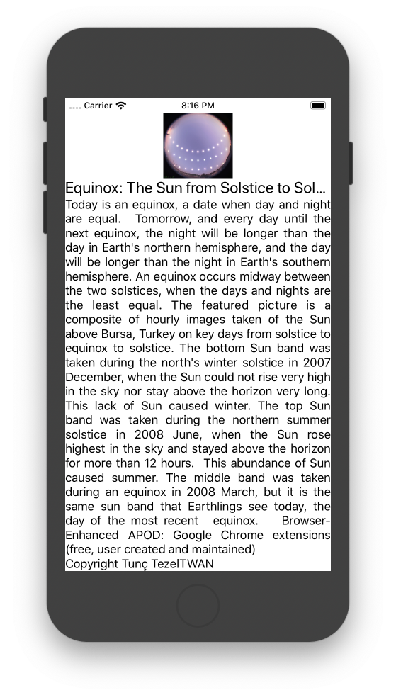

# iOS-Example-APITest
Basic API example - Nasa Astronomy Picture of the Day(APoD) Viewer

## Screenshot



## Requirements

* [NASA Open API KEY]

## Setup

To run this application you need an NASA Open API Key.
Get the API key from [here](https://api.nasa.gov/).

Create an `.xcconfig` file with your credentials:

```
NASA_OPEN_API_KEY=xxxxxxxxxxxxx
```
